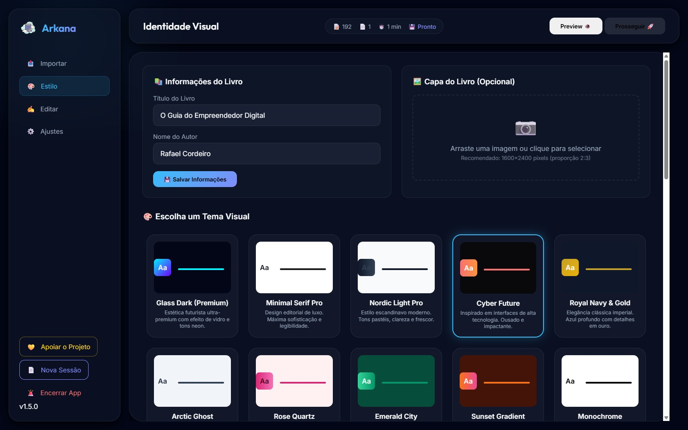
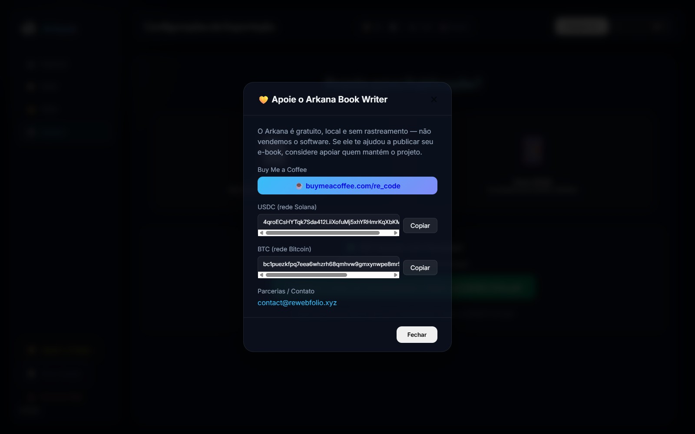

# 📚 Arkana Book Writer

A **100% local** professional tool for creating e-books in **PDF** and **EPUB** from Word (`.docx`), PDF, or Markdown (`.md`) documents. A Gamma.app-inspired interface: edit chapters, pick a theme, add a cover, and export — everything runs on your own machine, nothing is uploaded to the cloud.

- ✅ 40 ready-made publishing themes (classic, editorial, corporate, cyber, luxury, etc.)
- ✅ Custom cover upload
- ✅ Live preview of the selected theme
- ✅ Configurable margins, page size, title, and author
- ✅ High-fidelity PDF (WeasyPrint) and EPUB (ebooklib) export
- ✅ No data ever leaves your computer

---

## 🖼️ Screenshots

| Import a document | Pick a theme | Generated cover (Cyber Future) |
|---|---|---|
|  |  |  |

| Export PDF/EPUB | Support panel |
|---|---|
|  |  |

📄 **[See a sample PDF generated by Arkana](examples/exemplo-ebook.pdf)** — *Cyber Future* theme, generated with the app itself.

---

## 📥 Installation (step by step)

> Guide with a screenshot for every step: **[INSTALL_GUIDE.md](INSTALL_GUIDE.md)**.

### Windows — one click

**Prerequisites** (install once, before anything else):

1. **[Node.js](https://nodejs.org/)** — needed for the app window (Electron).
2. **[Python 3.10+](https://python.org/)** — check **"Add Python to PATH"** during installation.

**Installing the app:**

3. Extract the Arkana Book Writer `.zip` to any folder.
4. Double-click **`Install Dependencies.bat`**. This script alone:
   - checks that Node.js and Python are installed;
   - runs `npm install` (Electron window dependencies);
   - creates the `venv\` folder and runs `pip install -r requirements.txt` (Python dependencies: FastAPI, WeasyPrint, ebooklib, etc. — full list below).
   - Run this `.bat` again whenever `requirements.txt` or `package.json` change.

**Running it (every time you use it):**

5. Double-click **`Start Arkana.bat`**. It checks dependencies, starts the local backend, and opens the app window — leave that console window open while using Arkana, it's what keeps the server running.

> The two `.bat` files are separate on purpose: **installing** dependencies is a rare action (only the first time, or after updating the project); **starting** the app is what you run every day. No need to reinstall just to open the program.

### Python dependencies (`requirements.txt`)

`Install Dependencies.bat` already handles this, but if you'd rather install manually:

```bash
python -m venv venv
venv\Scripts\pip install -r requirements.txt   # Windows
venv/bin/pip install -r requirements.txt       # Linux/Mac
```

What's in `requirements.txt` (what each dependency does):

| Package | Purpose |
|---|---|
| `fastapi`, `uvicorn`, `python-multipart` | Local web server (backend) |
| `weasyprint` | PDF generation from the theme's HTML |
| `ebooklib` | EPUB generation |
| `python-docx` | Reading `.docx` files |
| `pypdf` | Reading imported `.pdf` files |
| `markdown`, `beautifulsoup4`, `lxml` | Markdown/HTML parsing |
| `jinja2` | Export theme templates |
| `pillow` | Image processing (cover, illustrations) |
| `requests` | Downloads the GTK runtime (`scripts/setup_gtk.py`) |

### Linux / macOS (manual)

```bash
python -m venv venv
venv/bin/pip install -r requirements.txt
venv/bin/python main.py
```

The app opens automatically in your browser at `http://127.0.0.1:8501`.

### Bare server (no window/browser)

```bash
pip install -r requirements.txt
uvicorn web_app:app --host 127.0.0.1 --port 8000
```

---

## ⚠️ PDF won't export? (Windows + WeasyPrint/GTK)

PDF export uses **WeasyPrint**, which on Windows depends on the **GTK3** libraries. If export fails with a missing-library error:

```bash
venv\Scripts\python scripts\setup_gtk.py
```

This downloads and installs the GTK runtime automatically. Then restart Arkana. Manual alternative: download the installer from [GTK-for-Windows-Runtime-Environment-Installer](https://github.com/tschoonj/GTK-for-Windows-Runtime-Environment-Installer/releases).

**EPUB export doesn't depend on GTK** and always works.

---

## 📁 Project Structure

```
main.py            → entry point (standalone/installed mode, port 8501)
web_app.py          → FastAPI application (/api/* routes)
core/                → document parser, PDF/EPUB generator, persistence
templates/           → interface HTML + theme catalog (themes.py)
static/              → interface CSS, JS, and assets
desktop/              → Electron window (desktop mode, port 8000)
scripts/              → .bat installers, GTK setup, utilities
uploads/              → imported files and covers (created at runtime, not versioned)
output/               → exported e-books (created at runtime, not versioned)
```

> In installed/packaged mode, `uploads/`, `output/`, and the session state live under `%APPDATA%\ArkanaBookWriter` (Windows) to keep them separate from the program folder.

---

## 🔧 Troubleshooting

| Problem | Solution |
|---|---|
| "Node.js not found" | Install it from [nodejs.org](https://nodejs.org/) and restart the terminal |
| "Python not found" | Install it from [python.org](https://python.org/), checking "Add to PATH" |
| App won't open / hangs during install | Delete the `node_modules` and `venv` folders and run `Install Dependencies.bat` again |
| PDF doesn't export | See the [GTK section above](#️-pdf-wont-export-windows--weasyprintgtk) |
| Port already in use | Close the other Arkana instance or restart your computer |

---

## ℹ️ About the Project

See [ABOUT.md](ABOUT.md) for the project's background, technical architecture, and sustainment model.

Want to contribute? See [CONTRIBUTING.md](CONTRIBUTING.md). Version history in [CHANGELOG.md](CHANGELOG.md).

## 📄 License

Distributed under the [MIT](LICENSE) license — open source, free to use, study, and modify.

**Notice:** Arkana Book Writer **is not sold**. It's a free, non-commercial project on the maintainer's part — no license fees, subscriptions, or usage charges. The MIT license lets anyone reuse the code (including commercially, if they want to build their own product from it), but Arkana itself is, and will remain, distributed for free. The only way to support the project is a voluntary donation (section below) — never required. See [NOTICE.md](NOTICE.md) for details.

---

## 💛 Support the Project

This app is free, local, and tracking-free. If it helped you publish your e-book, consider supporting its development:

- **Buy Me a Coffee:** [buymeacoffee.com/re_code](https://buymeacoffee.com/re_code)
- **USDC (Solana network):** `4qroECsHYTqk7Sda412LiiXofuMj5xhYRHmrKqXbKM8X`
- **BTC (Bitcoin network):** `bc1puezkfpq7eea6whzrh68qmhvw9gmxynwpe8mr5w509ycqcn3y64hq9ywjrn`
- **Partnerships / contact:** [contact@rewebfolio.xyz](mailto:contact@rewebfolio.xyz)

> The same support panel is available inside the app (the **💛 Support the Project** button in the sidebar).

---

*Arkana Book Writer — professional e-books, made locally.*
